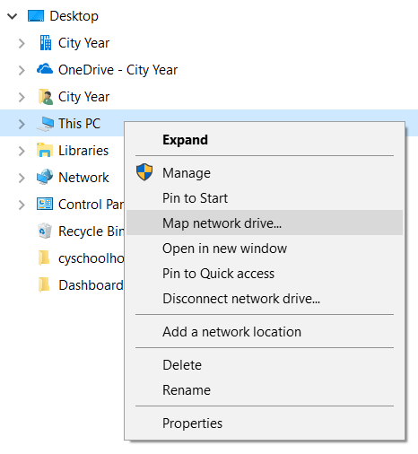
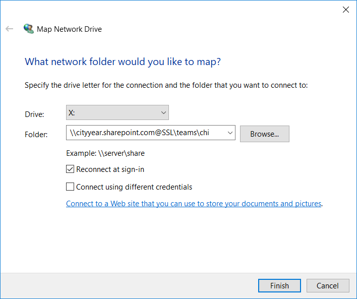

# Map cyconnect (SharePoint) as a Network Drive

1. Open your file explorer
* Right-click "This PC" and choose "Map Network Drive":

* Enter `\\cityyear.sharepoint.com@SSL\teams\xxx` (replace xxx with your site's 3-digit code as seen in your cyconnect homepage url)

* If this fails, login to cyconnect on Internet Explorer (32-bit). Navigate to a document library. Under "All Documents" choose "View in file Explorer". Choose to allow all pop-ups if necessary. Once the library opens in your file explorer, attempt try to map the network drive again.
* Add your favorite cyconnect locations to your "Quick access" panel

Note: you may need to periodically reconnect this network drive by logging in to cyconnect in the Internet Explorer browser. You don't need to redo all the steps - just logging in to cyconnect should re-establish the connection.
