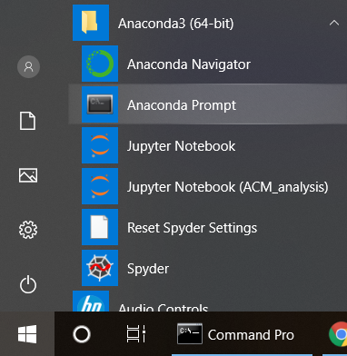
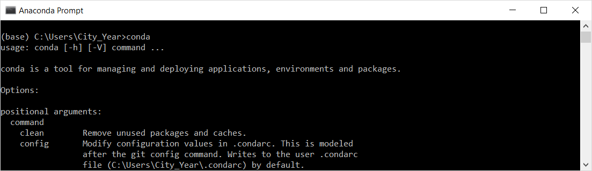
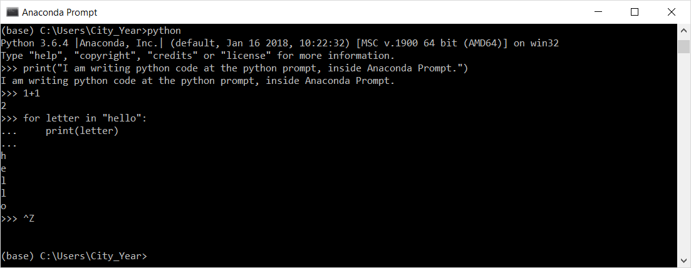

# Install Python via Anaconda

[Download Anaconda with Python 3.x](https://www.anaconda.com/download/) - Anaconda includes [many useful Python libraries](https://docs.anaconda.com/anaconda/packages/pkg-docs) like `pandas`, `numpy`, and `matplotlib` for data shaping, analysis, and visualization. It also includes `jupyterlab`, a handy browser-based editor.

Test your installation by opening Anaconda Prompt:

Type `conda` and hit enter, to show that Anaconda is recognized:

Python code is not interpreted at the Anaconda Prompt. Most people type python code in a text editor and save as `.py` file types. However, you can write python code at the Anaconda Prompt by typing `python` to enter into python's specific command prompt beginning as `>>>`:

After testing some python code, exit the prompt by typing `ctrl + Z`.

Learn more Python in the official [Python Tutorial](https://docs.python.org/3/tutorial/index.html).
