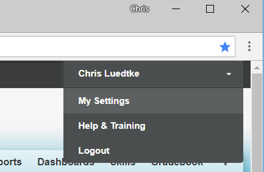
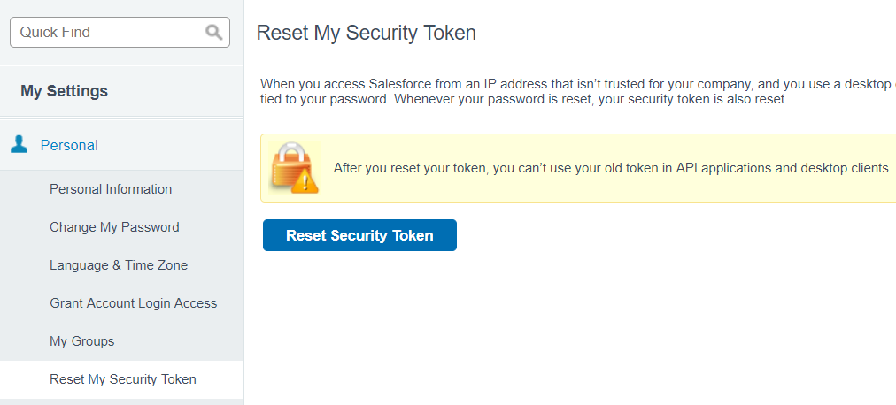

## Gather Your Salesforce Credentials

1. To pull salesforce (cyschoolhouse) data, you will need a certain email, password, and security token. This is the same as those needed to connect to salesforce through Power BI.
2. Your email login will be in the form `xxxxxxx@cityyear.org.cyschorgb`
3. Your password might not be the same as used in Okta. Submit a service desk ticket with category: *Network and Systems*, and subcategory: *cyschoolhouse: System Access* for an email to configure the password associated with your `xxxxxxx@cityyear.org.cyschorgb` salesforce account. Note: this will not affect your Okta universal login.
4. Log in to salesforce as usual
5. Navigate to settings

6. Under Personal, choose Reset Security Token, click the "Reset Security Token" button. This will trigger an email to your inbox containing your security token

